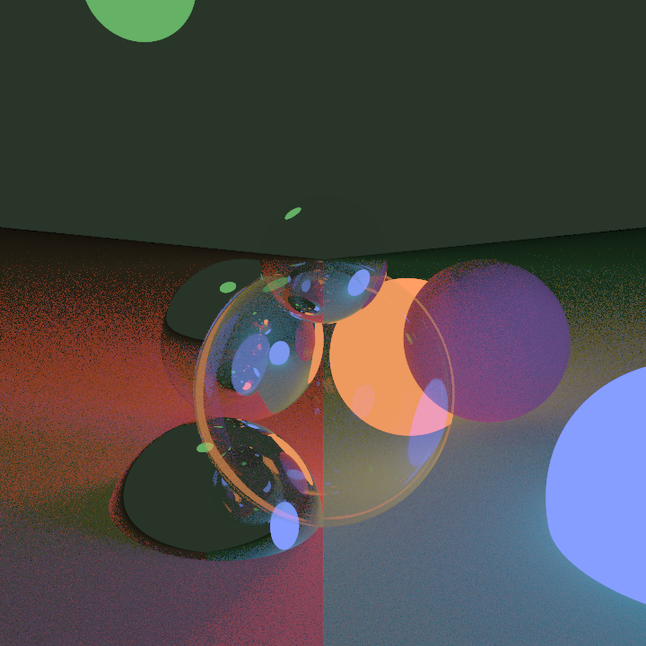
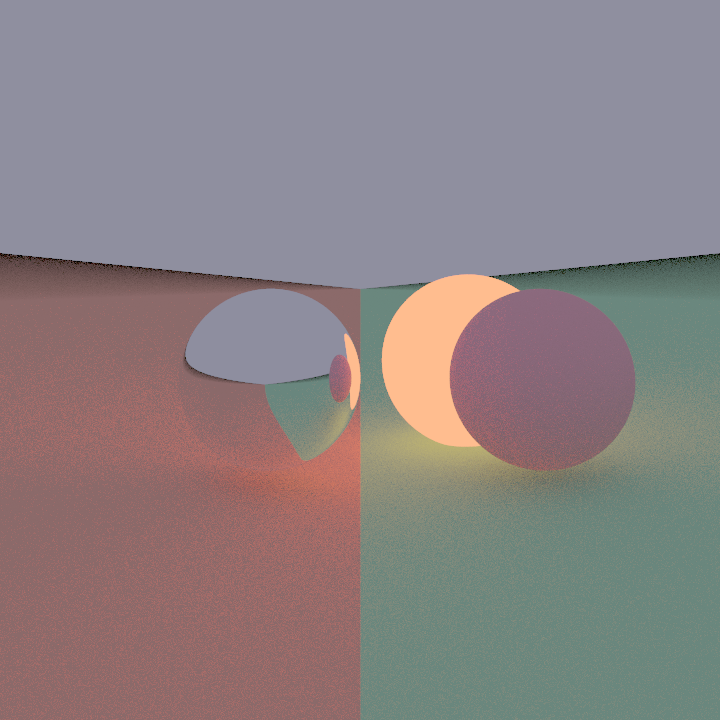

# Ray tracer

This is a [path-tracing](https://en.wikipedia.org/wiki/Path_tracing) [ray tracer](https://en.wikipedia.org/wiki/Ray_tracing_(graphics)) written in Haskell.

## Images

## Resources/inspiration

- [Handmade Hero ray tracer](https://www.youtube.com/watch?v=pq7dV4sR7lg&list=PLEMXAbCVnmY6eVE-F9KZbLZbJqjS_uby3&index=1)
- [TU Wien Rendering #29 - Path Tracing Implementation & Code Walkthrough](https://www.youtube.com/watch?v=cDi-uti2oLQ)
